<h1 align="center">
    <a href="">
        
    </a>
    <br/>
    squid 
    <br/>
</h1>

`squid` is a RISC-V emulator with features that make it a powerful tool for vulnerability research and fuzzing.

Unlike other emulators, `squid` utilizes AOT instead of JIT compilation and allows you to rewrite the binary's code before emulation.
During runtime, you get full control over your target by handling all system calls and other events yourself.
This makes it easy to create and combine new sanitizers and test programs for all kinds of vulnerabilities, not just memory corruptions.

Check out [this blog post (todo)]() to get an overview over `squid` and a demonstration of how to apply multiple different sanitizers to a target,
covering SQL injections, command injections, memory corruptions, and information disclosures.

## Features
- Fast snapshots
- Byte-level permissions on memory
- Rewriting binaries before emulation
- Integration into LibAFL
- Decent enough performance due to AOT compilation

However, it can only run single-threaded Linux user-space applications that are written in C.  
The source of the target _must_ be available because `squid` only supports binaries that have been compiled
with a specific set of flags.
This makes `squid` unsuitable for blackbox fuzzing. Instead, it was built to augment greybox fuzzing.
It is encouraged to combine `squid` with native fuzzers to achieve both, high throughput and enhanced bug detection.

## Demo
As a quick appetizer let's have a look at how we can overcome common restrictions of native sanitizers with `squid`.

One of the biggest restrictions is that multiple sanitizers cannot be combined in a single build.
Take the following program as an example. It contains both, uninitialized reads and out-of-bounds accesses:
```c
int main (int argc, char** argv) {
    int* array = malloc(16 * sizeof(int));
    int index = atoi(argv[1]);
    
    printf("array[%d] = %d\n", index, array[index]);
    
    return 0;
}
```

Trying something like
```
clang -fsanitize=address,memory,undefined test.c
```
results in
```
clang: error: invalid argument '-fsanitize=address' not allowed with '-fsanitize=memory'
```

However, since `squid` allows us to do binary rewriting, we can simply recreate ASAN + MSAN instrumentation ourselves.
We compile the test program to RISC-V with a specific set of flags:
```
riscv64-unknown-linux-gnu-gcc -o test -fPIE -pie -O0 -g -fno-jump-tables -mno-relax -D__thread= test.c
```

And create a harness that employs ASAN and MSAN instrumentation:
```rs
fn main() {
    // 1) Load and lift the target binary into our custom IR
    let mut compiler Compiler::loader()
        .binary("./test")  // The target binary
        .search_path(".")  // LD_LIBRARY_PATH
        .load();

    // 2) Run the ASAN pass over the binary to insert redzones
    //    and interceptors for the heap functions
    let mut asan_pass = AsanPass::new();
    compiler.run_pass(&mut asan_pass);

    // 3) AOT compile functions in IR down to native machine code by
    //    translating the IR to C code that we can compile with clang
    let arg = std::env::args().nth(1);
    let backend = ClangBackend::builder()
        .stack_size(2 * 1024 * 1024)
        .heap_size(16 * 1024 * 1024)
        .enable_uninit_stack(true) // MemorySanitizer
        .progname("test") // argv[0]
        .arg(arg) // argv[1]
        .source_file("./aot.c") // The AOT code goes into this file
        .build();
    let mut runtime = compiler.compile(backend);

    // 4) Emulate the binary, forward syscalls and handle interceptors
    println!("Running...");
    
    loop {
        match runtime.run() {
            Ok(event) => match event {
                EVENT_SYSCALL => forward_syscall(&mut runtime),
                _ => handle_asan_event(&asan_pass, event, &mut runtime),
            },
            Err(fault) => display_crash_report(fault, runtime),
        }
    }
}
```

Then, we can detect both crashes:  


## Getting Started
You can find detailed explanations how to harness `squid` in our [wiki](./wiki).   
For a gentle introduction, see the [hello world](./examples/helloworld) example.   
For an example how to combine native and emulation-based fuzzing, see our [readelf fuzzer](./examples/readelf).  
Finally, consult the documentation on [docs.rs](https://docs.rs/squid).

If you find that something is not properly documented / explained or you have any other questions, please
do not hesitate to [create an issue](https://github.com/fkie-cad/squid/issues/new).
