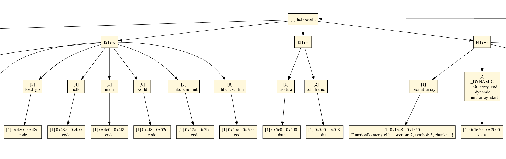

# Process Image

The process image is a data structure that holds the code and data of ELF files.   
It is the result of a dynamic linking process where all dependencies are collected,
allocatable sections are allocated, symbols are resolved, etc.
The only difference to traditional dynamic linking is that a process image is a hierachical tree structure and not a linear memory image.
This hierachical approach enables us to modify the ELF files' content without messing up its overall structure.
Its primary purpose is to make manipulations of global variables and functions easy.

Creating a process image is the first step in using `squid` and can be done with `Compiler::load_elf`:
```rs
let mut compiler = Compiler::load_elf(
    // The executable that we want to load
    "/path/to/binary",
    
    // Directories that contain the dependencies of the executable similar to LD_LIBRARY_PATH
    &[
        "/path/with/deps",
    ],
    
    // List of shared objects to preload similar to LD_PRELOAD
    &[
        "/path/to/library.so",
    ]
).expect("Loading binary failed");
```

This produces a process image that looks something like this (excerpt, the full graph can be found [here](./symimg.svg)):


As you can see the process image is a tree.   
The root points to loaded ELF files - in this case a "helloworld" executable and its dependency "libc.so.6".
The children of ELF files are their allocatable sections (here identified by their permission bits "rwx").
The children of sections are all ELF symbols that are inside those sections.
For example, the symbol "main" is a child of the section "r-x" because the program has a `main()` function.
The leafs of the process image are so-called "chunks".
Chunks hold the actual contents of a symbol and tell us how to interpret the stream of bytes.
It can either be code, data or a pointer.

One of the things you're gonna do most frequently with a process image is traversing it.
This can be done like so:
```rs
for elf in compiler.process_image().iter_elfs() {
    for section in elf.iter_sections() {
        for symbol in section.iter_symbols() {
            for chunk in symbol.iter_chunks() {
                match chunk.content() {
                    ChunkContent::Code(code) => {
                        // ...
                    },
                    ChunkContent::Data { bytes, perms } => {
                        // ...
                    },
                    ChunkContent::Pointer(pointer) => {
                        // ...
                    },
                }
            }
        }
    }
}
```

You can also add new nodes, delete nodes or modify existing nodes.   
To add new nodes call their respective builder objects, e.g. `Elf::builder()` or
`Section::builder()` and insert the newly created nodes via the `insert_*`
methods like `elf.insert_section(...)` or `section.insert_symbol(...)`.   
The following example demonstrates how to create an AFL-style coverage map and insert
it into the process image.

```rs
// This function will make it appear as if the AFL coverage map has been statically linked
// into the application. It creates a new ELF file with a single symbol "coverage_map" that
// holds the entire coverage map.
fn build_coverage_map(image: &mut ProcessImage, map_size: usize) {
    // The map will be readable and writable
    let mut perms = Perms::default();
    perms.make_readable();
    perms.make_writable();

    // The chunk holds the actual data and permission bits
    let chunk = Chunk::builder()
        .uninitialized_data(map_size, perms)
        .vaddr(0)
        .build()
        .unwrap();

    // Create a symbol named "coverage_map" that contains the chunk
    let mut symbol = Symbol::builder()
        .private_name("coverage_map")
        .vaddr(0)
        .size(map_size)
        .build()
        .unwrap();

    // Create a section that can hold the symbol
    let mut section = Section::builder()
        .perms(perms)
        .vaddr(0)
        .size(map_size)
        .build()
        .unwrap();

    // Finally, create the ELF file that contains the section
    let mut elf = Elf::builder()
        .path("<coverage map>")
        .build()
        .unwrap();

    // Chain all objects together
    symbol.insert_chunk(chunk);
    section.insert_symbol(symbol);
    elf.insert_section(section);
    image.insert_elf(elf);
}
```

## Symbolization
One key thing that has been left out so far is how `squid` handles code.   
Since the point of the process image is to manipulate binaries, we run into one particular problem.
Whenever there are pointers to objects inside ELF files, they may become invalid when manipulating the ELF files' content.
The way `squid` solves this problem is that it abstracts pointers with concrete values away to higher-level
"symbolic pointers".
A symbolic pointer also is a pointer but it points to a chunk in the process image instead of a memory location.
You may have noticed that in the image above each node in the tree is prefixed with a number in square brackets.
This is the ID of the element. Each child of each node gets a unique ID such that we can identify chunks with a
5-tuple of IDs: `(elf_id, section_id, symbol_id, chunk_id)`.
For example, every concrete pointer to the `main()` function has the value `0x4c0` in the ELF file but gets replaced with `(1, 2, 5, 1)`
in the process image.

In order to do this symbolization technique, the RISC-V code has to be lifted into an IR that is specifically designed
to make symbolization easy. This also means that when you want to modify functions, you have to
do it on the higher-level IR instead of the raw RISC-V code.
